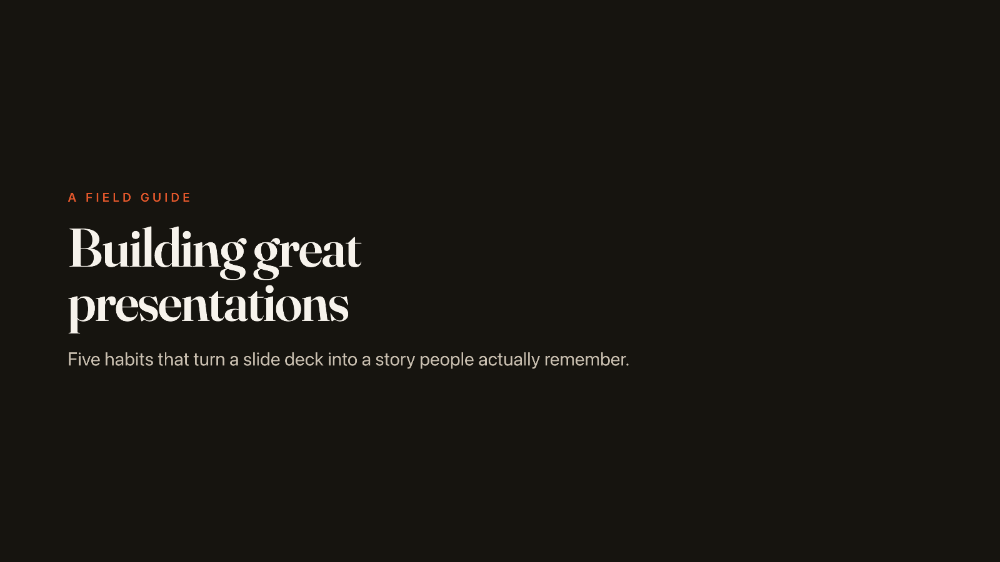
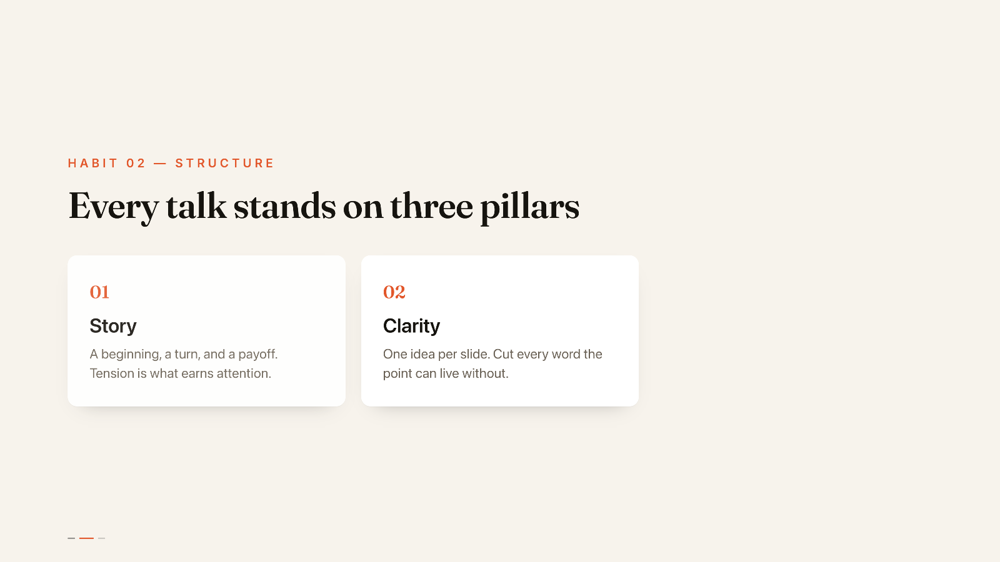
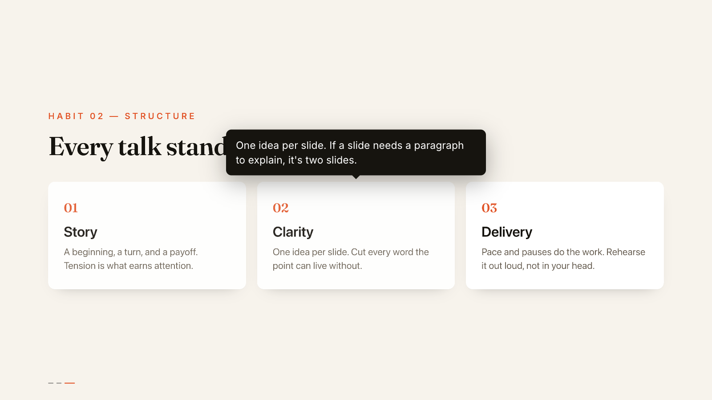
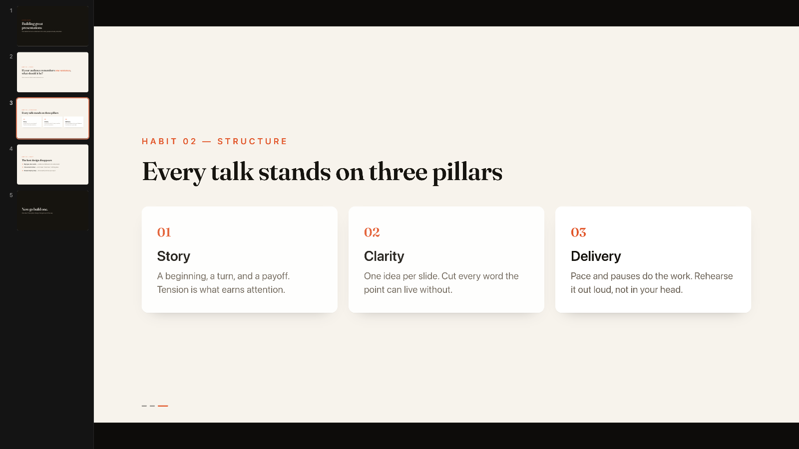
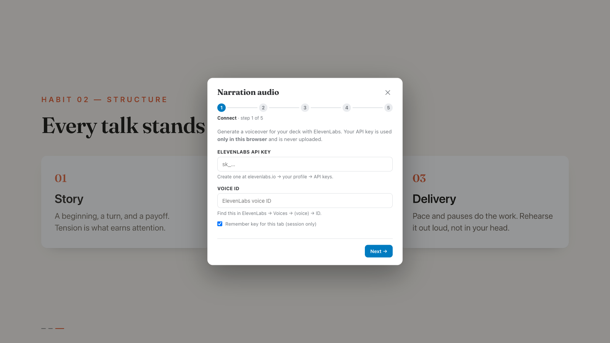
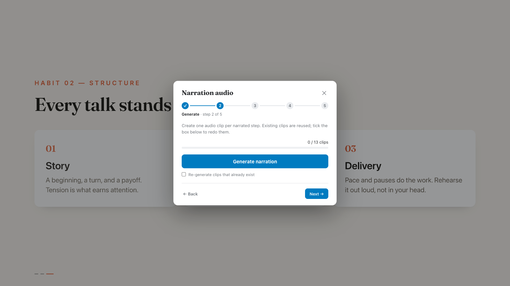

# OpenDeck

> Build **animated, narrated HTML presentation decks** with any coding agent.

OpenDeck is an [Agent Skill](https://www.agensi.io/learn/agent-skills-open-standard): slides that reveal step-by-step as you click, hover tooltips, a thumbnail rail, fullscreen, and **AI voice narration** generated in-browser (ElevenLabs) that bakes into a fully offline file. Optionally package a deck as a portable `.deck` file for a compatible player app.

The skill follows the universal `SKILL.md` standard, so the **same skill folder works in Claude Code, OpenCode, Codex, Gemini CLI**, and other compatible agents.



> The screenshots below are from the included demo deck, *"Building Great Presentations"* — authored with this skill, five slides, narration scripted.

```
opendeck/
├── .claude-plugin/          # Claude Code plugin + marketplace manifests
│   ├── marketplace.json
│   └── plugin.json
└── skills/
    └── opendeck/            # the portable skill (this is what every tool reads)
        ├── SKILL.md         # agent instructions
        ├── README.md        # human-facing kit guide
        └── assets/          # the shippable deck kit (engine, CSS, starter, schema)
```

---

## Install

### Claude Code

This repo is also a plugin marketplace, so installation is two commands:

```
/plugin marketplace add open-deck-org/opendeck
/plugin install opendeck@open-deck
```

(Or add it permanently to a project via `extraKnownMarketplaces` in `.claude/settings.json`.)

### OpenCode, Codex, Gemini CLI (and other `SKILL.md` agents)

These tools read skills from a local directory. Drop the `skills/opendeck/` folder into the right place:

| Agent        | Project-scoped                | User-scoped (global)                      |
| ------------ | ----------------------------- | ----------------------------------------- |
| OpenCode     | `.opencode/skills/opendeck/`  | `~/.config/opencode/skills/opendeck/`     |
| Codex        | `.codex/skills/opendeck/`     | `~/.agents/skills/opendeck/`              |
| Claude Code  | `.claude/skills/opendeck/`    | `~/.claude/skills/opendeck/`              |
| Gemini CLI   | (its configured skills dir)   | (its configured skills dir)               |

Fastest way to copy just the skill folder:

```bash
# requires Node (npx). Pulls only skills/opendeck/ — no git history.
npx degit open-deck-org/opendeck/skills/opendeck .opencode/skills/opendeck
```

Or clone and copy:

```bash
git clone https://github.com/open-deck-org/opendeck
cp -R opendeck/skills/opendeck ~/.config/opencode/skills/opendeck
```

---

## Use it

Once installed, ask your agent something like:

> *"Use the opendeck skill to build a narrated deck about our Q3 roadmap."*

The agent reads `SKILL.md` and scaffolds the deck from `assets/`. See **[`skills/opendeck/README.md`](skills/opendeck/README.md)** for the full walkthrough and **[`skills/opendeck/SKILL.md`](skills/opendeck/SKILL.md)** for the complete build guide.

---

## Presenting

Every deck gets a control bar (it fades in on mouse movement and hides while you present):


| Control | What it does |
| --- | --- |
| **‹ ›  ·  1 / 5** | Step through reveals, then move between slides. The counter shows your place. |
| **Reset · `R`** | Jump back to the first slide, step zero. |
| **Fullscreen · `F`** | Present edge-to-edge. |
| **Slides · `S`** | Toggle the thumbnail rail (slide overview). |
| **Narrate** | Master on/off for voice — every step you land on speaks. |
| **Auto-play** | Hands-free: reveal a step, play its clip, advance when it ends. |
| **Studio** | Authoring tools (generate audio, export). Blue, and **hidden in the exported file**. |

**Keyboard:** `←` / `→` step then change slides · `Space` / `PgDn` forward · `R` reset · number keys jump to a slide · `F` fullscreen · `S` slide rail.

### Step-by-step reveals

Add `data-step="1"`, `2`, `3`… to any element and it reveals in order as you click. Step dots (bottom-left) track progress automatically:



### Hover tooltips

Add `data-tip="…"` to any element for a smart tooltip that flips above or below to stay on screen — useful for speaker cues or definitions:



### Slide overview

Press `S` for the thumbnail rail — jump anywhere, and (when authoring) drag to reorder:



---

## Narration — the Audio Studio

Click the blue **Studio** button on the control bar. A five-step wizard walks you from key to offline file. **Your ElevenLabs API key is used only in your browser and is never written into any file** — only the generated audio clips get baked in.

**① Connect** — paste your ElevenLabs API key and Voice ID (kept for the session only).



> 🎙️ **Make it *your* voice.** You can [clone your own voice in minutes with ElevenLabs](https://elevenlabs.io/docs/eleven-creative/voices/voice-cloning/instant-voice-cloning) — record a minute or two of audio, grab the resulting Voice ID, and paste it here. Your deck then narrates in a voice your audience actually recognizes, for a personal, familiar touch no stock voice can match.

**② Generate** — create one audio clip per narrated step, watching the progress bar.



**③ Download** — save the generated clips as a `narration-audio.js` file.

**④ Place** — move that file into the same folder as your deck.

**⑤ Export** — ask your AI agent to *"build the standalone"*. It inlines the scripts, the baked audio, and the fonts into **one self-contained `.html` that narrates offline, anywhere, with no key and no companion files**. To present on a phone or tablet, ask it to *"package this as a `.deck` file"* for a compatible player app.

You write the narration text (one line per slide/step) in `narration-script.js`; the Studio reads it and keys each clip to its step.

---

## License

[MIT](LICENSE) © Sinisha Djukic
